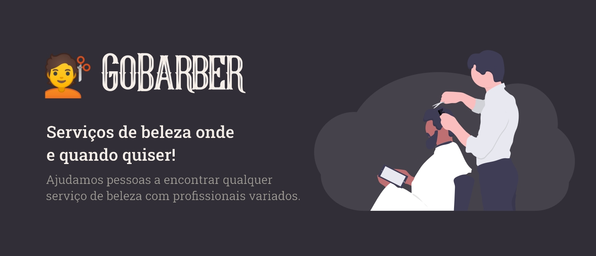

<h1 align="center">
    
</h1>

<h3 align="center">GoStack 11 - Em construção 🚧</h3>

<p align="center">
    <a href="https://www.repostatus.org/#wip"></a>
    
    
    
    <a href="https://github.com/gabrielbartoczevicz/gobarber/blob/master/LICENSE"></a>
</p>

## About

O GoBarber é um aplicativo para ajudar os usuários a agendar serviços de beleza, atualmente serviços de barberaria e corte de cabelo em geral.

Na aplicação web o prestador de serviço pode listar os agendamentos marcados ao dia, tendo acesso também a um calendário.
No aplicativo mobile o usuário poderá criar um agendamento, onde terá uma duração de no máximo 1 hora e com vagas das 8 da manhã até às 6 da tarde.

Este projeto está sendo desenvolvido no curso Bootcamp Go Stack, na 11⁹ edição, da [Rocketseat](http://rocketseat.com.br/).

## Layout - Em construção 🚧

***Link para o Figma***

***Gifs do app web***

***Gifs do app mobile***

## Coding - Em construção 🚧

Consulte os README em cada pasta do projeto (server, web, mobile) para executar a aplicação. Ambos os app mobile e web dependem do server executanto.

### Tips 💡

Use o comando ```adb reverse tcp:3333 tcp:3333``` para o app na plataforma Android acessar o servidor (e imagens).
Tenha o Docker e o Docker Compose para facilitar a execução dos banco de dados do server.

## Roadmap 🛣️ - Em construção 🚧

Eu vejo que essa aplicação desenvolvida no Go Stack 11 é totalmente escalável, por isso pensei em alguns pontos que podem melhorar e outras coisas que posso implementar ao longo do tempo :)

- [] Sistema de cache ao cadastrar um novo user
- [] Implementar Toasts como notificações no app mobile
- [] Melhorar estrutura de diretórios do app mobile
- [] Implementar recuperar senha no app mobile
- [] Implementar categorias de serviços no projeto
- [] Implementar cadastro de endereço de atendimento (Junto de mapas)
- [] Flexibilizar horário de atendimento
- [] Adicionar telefone para a comunicação entre usuário e prestador de serviço
- [] Criar uma aba de notificações

## 📝 Licença

Este projeto esta sobe a licença MIT.

***

Feito com ❤️ por Gabriel Bartoczevicz [Entre em contato!](https://www.linkedin.com/in/gabriel-bartoczevicz-7360901a6/)